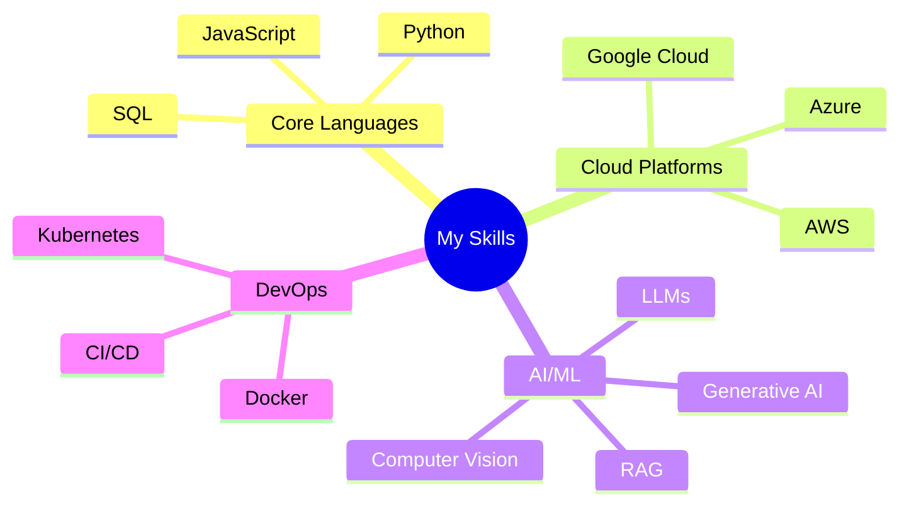

<!--
**mrvivekkumar7171/mrvivekkumar7171** is a ✨ _special_ ✨ repository because its `README.md` (this file) appears on your GitHub profile.

Here are some ideas to get you started:

- 🔭 I’m currently working on ...
- 🌱 I’m currently learning ...
- 👯 I’m looking to collaborate on ...
- 🤔 I’m looking for help with ...
- 💬 Ask me about ...
- 📫 How to reach me: ...
- 😄 Pronouns: ...
- ⚡ Fun fact: ...
-->
<h1> <a href="https://github.com/mrvivekkumar7171">Vivek!</a></h1>
<h3 align="center">🌟 Data Scientist | Python Developer | Linux User 🌟</h3>

  
  
  

<h3 align="center">I am an aspiring Data Scientist specializing in end-to-end AI solution development using AWS. My expertise spans:</h3>

|  | Machine Learning & Deep Learning |
|:--:|:---|
|  | Large Language Models & Generative AI |
|  | Google Contact Centre AI Implementation |
|  | Scalable AI Systems Architecture |
|  | Business-Focused AI Solutions |

##  Tech Stack

---

🔭 I’m currently working on **Python automation & AI-based projects**  
🌱 I’m learning **Machine Learning, Cloud (AWS), and MLOPs**  
💬 Ask me about **Python, Linux, Web Dev, GitHub**  
📫 How to reach me: **mrvivekkumar7171@gmail.com**  
⚡ Fun fact: _“Linux is love, Python is life.”_ 
> “Building the future with code, one repo at a time.”  

### 🛠️ Tech Stack

- **Languages**: Python, SQL
- **AI/ML**: scikit-learn, TensorFlow, OpenCV  
- **Cloud**: AWS
- **Tools**: Git, GitHub, VS Code, Docker  
- **OS**: Linux Ubuntu, Windows

---

### Core Technologies

### Development Tools & Frameworks

### 📈 GitHub Stats

  
  
  
  
  

#### Vivek's LeetCode Stats! [LC Profile](https://leetcode.com/mrvivekkumar7171)

  

---

### 📢 Connect with me

**Languages and Tools:**

<code></code>
<code></code>
<code></code>
<code></code>
<code></code>
<code></code>

##  Support My Work

  

