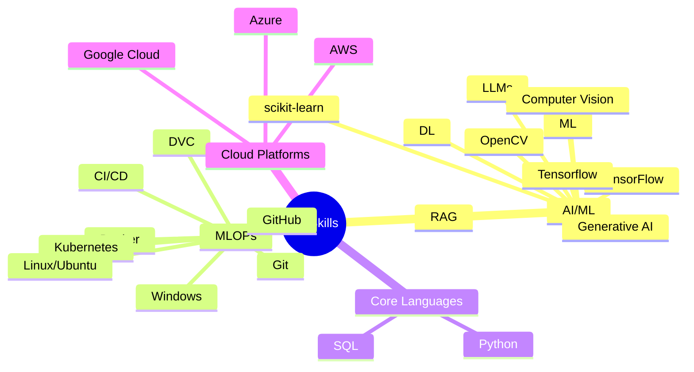

<!--
**mrvivekkumar7171/mrvivekkumar7171** is a ✨ _special_ ✨ repository because its `README.md` (this file) appears on your GitHub profile.

Here are some ideas to get you started:

- 🔭 I’m currently working on ...
- 🌱 I’m currently learning ...
- 👯 I’m looking to collaborate on ...
- 🤔 I’m looking for help with ...
- 💬 Ask me about ...
- 📫 How to reach me: ...
- 😄 Pronouns: ...
- ⚡ Fun fact: ...
-->

#  Hi there, I'm <a href="https://github.com/mrvivekkumar7171">Vivek</a>!
<h3 align="center">🌟 Data Scientist | Python Developer | Automation | AI-based projects | Web Dev🌟</h3>

  
  
  

# About Me
> “Data Science is love, Python is life.”

<h4 style="font-weight: normal;">An aspiring Data Scientist specializing in end-to-end AI solution development using AWS. My expertise spans:</h4>

|  | Machine Learning & Deep Learning |
|:--:|:---|
|  | Large Language Models & Generative AI |
|  | Youtube comment Analysis |
|  | Scalable AI Systems Architecture |
|  | Business-Focused AI Solutions |

#  Tech Stack

#  Core Technologies

#  Development Tools, Languages & Frameworks

#  GitHub Stats

  
  
  

#  [Vivek's LeetCode](https://leetcode.com/mrvivekkumar7171) Stats!

  

#  Connect with me

#  Support My Work

  

